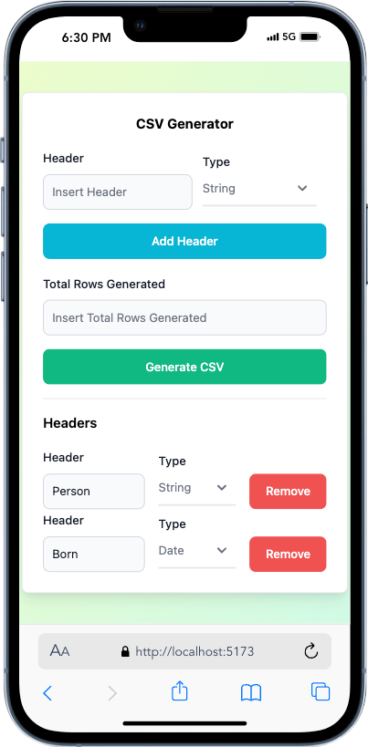

# Simple CSV Generator

Simple CSV Generator is a web-based tool designed to create CSV files with customizable headers and data types. Users can specify header names and types (text, number, date), and generate a CSV file with a specified number of rows. This project was created as a way to fill free time and enhance my portfolio, showcasing my skills in web development using modern technologies.

## About This Project

This project was created during my free time as a simple portfolio project. The goal was to demonstrate my proficiency in building web applications using a modern tech stack. By building this project, I aimed to create something practical and useful, showcasing my ability to implement both backend and frontend technologies effectively.

## Features

- **Customizable Headers**: Define headers with specific types (text, number, date).
- **Row Generation**: Specify the number of rows to be generated in the CSV file.
- **Downloadable CSV**: Generate and download the CSV file directly from the web interface.
- **User-Friendly Interface**: Clean and intuitive interface for easy use.

## Built With

- **Backend**: Express.js with TypeScript
- **Frontend**: React.js with TypeScript
- **Styling**: Tailwind CSS, with components from Flowbite

## Screenshots

### Web Layout

*Web layout page of Simple CSV Generator*

*Web layout page with headers of Simple CSV Generator*

### Mobile Layout

*Mobile layout page of Simple CSV Generator*

*Mobile layout page with headers of Simple CSV Generator*

## Getting Started

To get a local copy up and running, follow these simple steps.

### Prerequisites

- Node.js >= 14.x
- npm or yarn

### Contacts

- Email : muhammadnurazismu@gmail.com
- Linkedin : https://www.linkedin.com/in/muhammad-nur-azis-mujiono/
